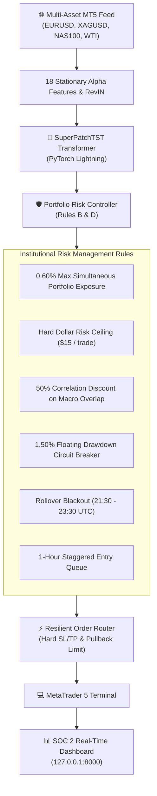

# 🏛️ AetherQuant-MT5: Autonomous Multi-Asset Quantitative Trading System

[](https://www.python.org/downloads/release/python-3110/)
[](https://lightning.ai/)
[](https://www.mql5.com/)
[](http://127.0.0.1:8000)
[](docs/WHITE_PAPER.md)
[](LICENSE)

An institutional-grade, multi-asset algorithmic trading system designed for automated execution on **MetaTrader 5 (MT5)**. Built upon the `K-Dense-AI / scientific-agent-skills` framework, it integrates **Patch Time-Series Transformers (PatchTST)**, multi-resolution cross-attention, survival hazard analysis, and dynamic institutional risk controllers.

> 📖 **Read the Complete Technical White Paper:** [**`docs/WHITE_PAPER.md`**](docs/WHITE_PAPER.md) for full mathematical formulations, loss engineering, and architecture diagrams.

---

## 📐 Architecture Overview



---

## 🏛️ Four Institutional Guardrails

1. **Rule A (Data Safety & Stationarity):**
   - Strict expanding temporal cross-validation (`TimeSeriesSplit`).
   - Zero forward-looking data leakage; scalers fit strictly on train folds.
   - All input features verified for stationarity via ADF testing.

2. **Rule B (Mandatory Risk Management):**
   - Mandatory hard **Stop Loss (SL)** and **Take Profit (TP)** on every dispatched order.
   - Dynamic ATR position sizing with a **Hard Dollar-Risk Ceiling** overriding broker minimum lot constraints.
   - Robust retry handlers for `order_send()`.

3. **Rule C (Execution & Model Isolation):**
   - High-performance PyTorch Lightning GPU execution with 16-bit Automatic Mixed Precision (AMP).
   - Independent RL vectorization layers isolated without API mixing.

4. **Rule D (Anti-Correlation & Hazard Diagnostics):**
   - Cross-asset correlation gates applying a 50% risk discount on overlapping USD drivers.
   - Floating drawdown circuit breaker triggering an immediate trading halt at 1.50%.
   - SHAP feature attributions and survival duration hazard modeling.

---

## 📂 Modular Skill Structure

```
AetherQuant-MT5/
├── .agents/skills/                   # Modular Scientific Skills
│   ├── mt5_execution/                # MT5 connection, RiskManager, OrderRouter, PortfolioRiskController
│   ├── time_series_deep_learning/    # PyTorch Lightning PatchTST, RevIN, Multi-Horizon Sequence Modeling
│   ├── pufferlib_rl_trading/         # Reinforcement learning execution & portfolio policies
│   └── survival_ml_interpretability/ # scikit-survival duration models & SHAP diagnostics
├── checkpoints/                      # Pretrained Transformer model checkpoints (.ckpt)
├── scripts/                          # Training, backtesting, and live execution daemons
│   ├── train_super_alpha_model.py    # Multi-Asset SuperPatchTST training pipeline
│   ├── multi_year_portfolio_backtest.py # 4-Year multi-asset backtesting engine
│   ├── live_trading_daemon.py        # Autonomous concurrent live execution daemon
│   └── dashboard_server.py           # SOC 2 compliant real-time monitoring server
├── web/                              # Dark-mode high-frequency monitoring interface
│   ├── index.html                    # Real-time multi-asset terminal layout
│   ├── index.css                     # Curated CSS tokens & glassmorphism theme
│   └── app.js                        # High-frequency telemetry stream controller
├── .env.example                      # Sanitized environment configuration template
├── requirements.txt                  # Python dependencies
└── README.md                         # System documentation
```

---

## 🚀 Quickstart & Setup

### 1. Prerequisites
- **Python 3.11+**
- **MetaTrader 5 Desktop Terminal** (installed and logged into your broker)
- NVIDIA GPU with CUDA (Optional, but recommended for training)

### 2. Installation
Clone the repository and install required packages:
```bash
git clone https://github.com/ElMoorish/AetherQuant-MT5.git
cd AetherQuant-MT5
pip install -r requirements.txt
```

### 3. Environment Configuration
Copy the configuration template and enter your MT5 credentials:
```bash
cp .env.example .env
```
Edit `.env` with your settings:
```env
MT5_LOGIN=12345678
MT5_PASSWORD=your_password
MT5_SERVER=YourBroker-Demo
MAGIC_NUMBER=10101
BASE_RISK_PCT=0.0015
PORTFOLIO_RISK_CAP=0.0060
```

---

## 💻 Operating Workflows

### A. Train the Multi-Asset Transformer
Train the `SuperPatchTST` model on GPU across the 4-asset universe:
```bash
python scripts/train_super_alpha_model.py
```

### B. Run Multi-Year Portfolio Backtest
Evaluate full-cycle performance across multi-year historical spans:
```bash
python scripts/multi_year_portfolio_backtest.py
```

### C. Launch Autonomous Live Execution Daemon
Start the autonomous background execution daemon in live-demo or paper mode:
```bash
python scripts/live_trading_daemon.py --mode live-demo --base-risk 0.0015 --portfolio-risk-cap 0.0060 --magic 10101
```

### D. Launch SOC 2 Real-Time Monitoring Dashboard
Start the local monitoring dashboard:
```bash
python scripts/dashboard_server.py
```
Open your browser at [**http://127.0.0.1:8000**](http://127.0.0.1:8000) for real-time telemetry streaming.

---

## 🔒 Security & Privacy

- **Strict Local Loopback:** The dashboard server binds exclusively to `127.0.0.1` (never exposed to external networks).
- **OWASP Security Headers:** Enforces Content Security Policy (CSP), X-Frame-Options (`DENY`), and X-Content-Type-Options (`nosniff`).
- **Zero Hardcoded Secrets:** All credentials are loaded exclusively from `.env` or system environment variables.

---

## 👨‍💻 Author & Maintainer

**ElMoorish**
* Full Stack Developer & Cybersecurity Enthusiast | Applied AI/ML & Quantitative Systems
* GitHub: [@ElMoorish](https://github.com/ElMoorish)

---

## 📜 License

This project is licensed under the MIT License — see the [LICENSE](LICENSE) file for details.
