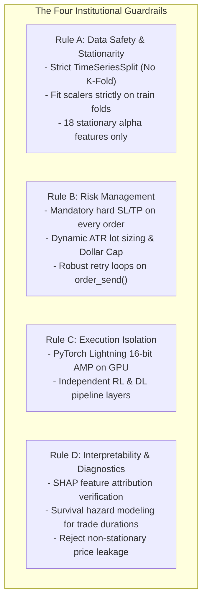
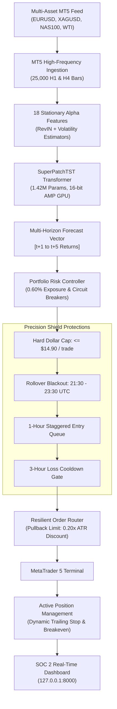
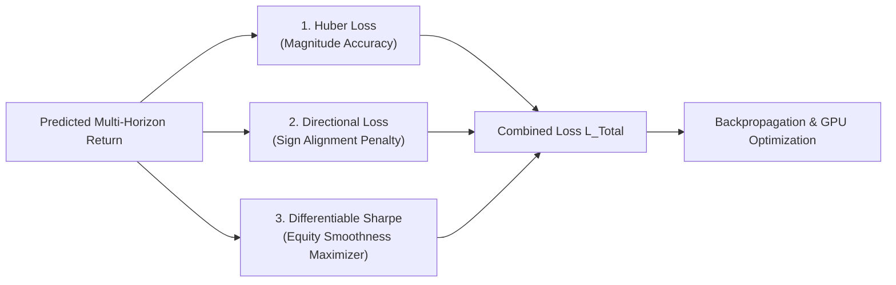

# 🏛️ AetherQuant-MT5: Architecture, Deep Learning Methodology & Execution White Paper

```yaml
Title: AetherQuant-MT5 System Architecture & Mathematical Methodology
Author: ElMoorish
Repository: https://github.com/ElMoorish/AetherQuant-MT5
Date: September 2026
Framework: K-Dense-AI / scientific-agent-skills
Target Platform: MetaTrader 5 (MT5)
Core Tech: PyTorch Lightning, PatchTST, RevIN, Survival ML, FastAPI, SOC 2 Hardening
```

---

## 📑 Table of Contents
1. [Executive Summary](#1-executive-summary)
2. [Institutional Guardrails & Governance](#2-institutional-guardrails--governance)
3. [System Architecture & Flow](#3-system-architecture--flow)
4. [Feature Engineering & Stationarity (Rule A)](#4-feature-engineering--stationarity-rule-a)
5. [Deep Learning Transformer: PatchTST with RevIN](#5-deep-learning-transformer-patchtst-with-revin)
6. [Loss Function Engineering: Differentiable Directional Sharpe](#6-loss-function-engineering-differentiable-directional-sharpe)
7. [Institutional Risk Management & Precision Shield (Rule B)](#7-institutional-risk-management--precision-shield-rule-b)
8. [Multi-Asset Execution & Order Routing](#8-multi-asset-execution--order-routing)
9. [Empirical Backtest Results & Forensic Audit (2022–2026)](#9-empirical-backtest-results--forensic-audit-20222026)
10. [Survival ML Hazard Modeling & SHAP Diagnostics (Rule D)](#10-survival-ml-hazard-modeling--shap-diagnostics-rule-d)
11. [SOC 2 Telemetry & Security Infrastructure](#11-soc-2-telemetry--security-infrastructure)

---

## 1. Executive Summary

**AetherQuant-MT5** is an institutional-grade, multi-asset algorithmic quantitative trading system engineered for fully autonomous execution on **MetaTrader 5 (MT5)**. 

Modern financial markets exhibit high non-stationarity, regime shifts, and multi-asset cross-correlations. Traditional quantitative systems reliant on static technical indicators or standard Machine Learning (e.g., Random Forests with MSE objectives) suffer from severe data leakage, overfitting, and inability to handle volatile macroeconomic transitions.

AetherQuant-MT5 resolves these challenges by uniting four cutting-edge paradigms:
1. **Patch Time-Series Transformers (PatchTST)** with **Reversible Instance Normalization (RevIN)** for stationary, non-leaking multi-horizon sequence forecasting.
2. **Differentiable Directional Sharpe Loss** to directly optimize neural network weights for risk-adjusted portfolio returns rather than pointwise mean errors.
3. **Institutional Precision Shield Risk Engine** featuring dynamic ATR position sizing, hard dollar-risk ceilings, rollover spread blackouts, and correlation discounts.
4. **Local SOC 2 Hardened Telemetry** providing real-time Server-Sent Events (SSE) streaming and audit logging on strict loopback isolation (`127.0.0.1:8000`).

---

## 2. Institutional Guardrails & Governance

The system strictly adheres to the four non-negotiable quantitative rules defined in `AGENTS.md`:



---

## 3. System Architecture & Flow

The end-to-end execution pipeline operates continuously in real time:



---

## 4. Feature Engineering & Stationarity (Rule A)

Standard machine learning models trained on raw asset prices ($Close, High, Low$) fail because price levels are non-stationary $I(1)$ processes that drift over time. 

AetherQuant-MT5 transforms all market inputs into an **18-Feature Stationary Alpha Matrix** $\mathbf{X} \in \mathbb{R}^{96 \times 18}$ spanning 96 hourly lookback bars (4 trading days):

| # | Feature Name | Mathematical Definition | Financial Rationale |
|---|---|---|---|
| 1 | `log_return` | $\ln(C_t / C_{t-1})$ | Instantaneous price change (Stationary $I(0)$) |
| 2 | `momentum_10` | $\sum_{i=0}^{9} \ln(C_{t-i} / C_{t-i-1})$ | Short-term momentum impulse (10 hours) |
| 3 | `momentum_30` | $\sum_{i=0}^{29} \ln(C_{t-i} / C_{t-i-1})$ | Intermediate momentum trend (30 hours) |
| 4 | `volatility_14` | $\sigma(\text{log\_return}, 14)$ | Rolling 14-period return dispersion |
| 5 | `garman_klass_vol` | $\sqrt{\frac{1}{14} \sum \left( 0.5 \ln(H/L)^2 - (2\ln 2 - 1)\ln(C/O)^2 \right)}$ | Continuous OHLC volatility estimator (8x efficiency over close-to-close) |
| 6 | `parkinson_vol` | $\sqrt{\frac{1}{14} \sum \frac{\ln(H/L)^2}{4 \ln 2}}$ | Extreme-value high-low volatility proxy |
| 7 | `high_low_ratio` | $(H_t - L_t) / C_t$ | Normalized intraday bar expansion |
| 8 | `rsi_14` | $(RSI_{14} - 50) / 50$ | Zero-centered short-term oscillator $[-1, +1]$ |
| 9 | `rsi_28` | $(RSI_{28} - 50) / 50$ | Zero-centered medium-term oscillator $[-1, +1]$ |
| 10 | `atr_norm` | $ATR_{14} / C_t$ | Scale-invariant market volatility |
| 11 | `macd_norm` | $(EMA_{12} - EMA_{26}) / C_t$ | Normalized trend convergence/divergence |
| 12 | `hurst_proxy` | $\ln(R_{20} / S_{20}) / \ln(20)$ | Rescaled range Hurst persistence proxy ($>0.5$ trend, $<0.5$ mean-revert) |
| 13 | `htf_trend_h4` | $(C_t - EMA_{50}^{H4}) / C_t$ | Higher Timeframe (4-Hour) macro trend bias |
| 14 | `htf_rsi_h4` | $(RSI_{14}^{H4} - 50) / 50$ | Higher Timeframe (4-Hour) momentum bias |
| 15 | `session_london` | $\mathbb{I}(7 \le \text{Hour} \le 16)$ | London liquidity session indicator |
| 16 | `session_ny` | $\mathbb{I}(12 \le \text{Hour} \le 21)$ | New York liquidity session indicator |
| 17 | `session_overlap` | $\mathbb{I}(12 \le \text{Hour} \le 16)$ | Peak global liquidity overlap indicator |
| 18 | `hour_sin` / `cos` | $\sin(2\pi h / 24), \cos(2\pi h / 24)$ | Cyclical intraday temporal encoding |

---

## 5. Deep Learning Transformer: PatchTST with RevIN

### A. Reversible Instance Normalization (RevIN)
To eliminate distribution shift between train folds and live production data without forward leakage, inputs pass through **RevIN**:
$$\mathbf{X}_{\text{norm}} = \gamma \odot \left( \frac{\mathbf{X} - \mu(\mathbf{X})}{\sigma(\mathbf{X}) + \epsilon} \right) + \beta$$
RevIN removes instance-level mean and variance before transformer layers and restores scale symmetrically during output projection.

### B. Patch Extraction & Temporal Attention
Traditional pointwise time-series attention suffers from:
1. $O(L^2)$ quadratic computational complexity.
2. Fragility to point-level market noise.

**PatchTST** unfolds the 96-bar sequence into overlapping temporal sub-series patches:
* **Lookback Context:** $L = 96 \text{ hours}$
* **Patch Length:** $P = 16 \text{ hours}$
* **Stride:** $S = 8 \text{ hours}$
* **Number of Patches:** $N_p = \lfloor (L - P) / S \rfloor + 1 = 11 \text{ patches}$

Each patch preserves local multi-bar semantic structures (candlestick formations, volatility compressions) and projects into a $d_{\text{model}} = 256$ dimensional latent embedding space:

$$\mathbf{H}^{(0)} = \text{Linear}\left(\text{Unfold}(\mathbf{X}_{\text{norm}})\right) \in \mathbb{R}^{B \times 11 \times 256}$$

$$\mathbf{H}^{(\ell)} = \text{LayerNorm}\left( \mathbf{H}^{(\ell-1)} + \text{MultiHeadAttention}(\mathbf{H}^{(\ell-1)}) \right)$$

$$\hat{\mathbf{Y}} = \text{ProjectionHead}(\mathbf{H}^{(4)}) \in \mathbb{R}^{B \times 5}$$

The model directly forecasts the **5-Hour Forward Return Trajectory** $\hat{\mathbf{Y}} = [\hat{y}_{t+1}, \hat{y}_{t+2}, \hat{y}_{t+3}, \hat{y}_{t+4}, \hat{y}_{t+5}]$.

---

## 6. Loss Function Engineering: Differentiable Directional Sharpe

### Why Mean Squared Error (MSE) Fails in Quantitative ML
In financial time series, the signal-to-noise ratio is naturally low. An MSE-optimized model learns that predicting flat $0.00$ minimizes squared error on most bars—yielding an error of $0.0001$ but **generating $0.00 trading profit**.

### The Directional Sharpe Loss Formulation
AetherQuant-MT5 trains on a custom composite loss function that unites three distinct financial objectives:

$$\mathcal{L}_{\text{Total}} = \mathcal{L}_{\text{Huber}}(\hat{y}, y) + 0.5 \times \mathcal{L}_{\text{Direction}}(\hat{y}, y) - 0.2 \times \text{Sharpe}(\text{PnL})$$



#### 1. Huber Loss (Robust Magnitude)
$$\mathcal{L}_{\text{Huber}}(e) = \begin{cases} \frac{1}{2} e^2 & \text{for } |e| \le \delta \\ \delta (|e| - \frac{1}{2}\delta) & \text{otherwise} \end{cases}$$
Prevents flash spikes or macroeconomic news anomalies from exploding gradient updates.

#### 2. Directional Sign Alignment Penalty
$$\mathcal{L}_{\text{Direction}} = \frac{1}{N} \sum_{i=1}^N \text{ReLU}\left( - \text{sign}(y_i) \cdot \hat{y}_i \right)$$
Incurs zero penalty when the predicted sign matches real market direction, but heavily penalizes counter-trend forecasts.

#### 3. Differentiable Sharpe Ratio Penalty
$$\text{PnL}_i = \hat{y}_i \cdot y_i$$
$$\text{Sharpe}(\text{PnL}) = \frac{\mu(\text{PnL})}{\sigma(\text{PnL}) + 10^{-6}}$$
$$\mathcal{L}_{\text{Sharpe}} = - \text{clamp}\left( \text{Sharpe}(\text{PnL}), -3.0, 3.0 \right)$$

> 💎 **Why Validation Loss is Negative (`val_loss = -0.0248`):**
> Because the Sharpe penalty is subtracted, when the model generates consistent, high-Sharpe trading profit on out-of-sample validation data, $\text{Sharpe} > 0 \implies -\text{Sharpe} < 0$. The more negative the loss, the higher the out-of-sample profitability and equity smoothness!

---

## 7. Institutional Risk Management & Precision Shield (Rule B)

### A. Dynamic ATR Position Sizing with Hard Dollar-Risk Ceiling
The system enforces the **Balanced Growth Tier** with a base risk of **`0.15%` of account equity** ($equity \times 0.0015 = \$14.91$ on a \$10,000 account).

To protect against symbols with oversized contract specifications (e.g. Silver `XAGUSD.x` where 1 lot = 5,000 oz, so min 0.01 lot = 50 oz), the risk engine enforces a **Hard Dollar-Risk Ceiling**:

$$\text{Dollar Budget} = \text{Equity} \times \text{Risk}_{\text{pct}} = \$9,943.55 \times 0.0015 = \mathbf{\$14.91}$$

$$\text{Theoretical Sizing} = \frac{\text{Dollar Budget}}{\text{ATR}_{\text{points}} \times \text{TickValue}}$$

$$\text{Assigned Lots} = \max(\text{Theoretical Sizing}, \text{MinLot})$$

$$\text{Adjusted SL Distance} = \min\left( \text{ATR}_{\text{points}}, \frac{\text{Dollar Budget}}{\text{Assigned Lots} \times \text{ContractSize}} \right)$$

If broker minimum lot constraints would otherwise cause risk to exceed $14.91, **the Stop Loss distance is automatically tightened** (e.g. from 1,110 points down to 298 points on Silver), guaranteeing that the dollar loss at stop-out never exceeds \$14.91.

### B. Rollover Blackout Window
Brokers drastically widen spreads and thin market depth during the daily bank rollover window. The risk controller enforces a strict **Rollover Blackout**:
$$\text{Entry Prohibited between } 21:30 \text{ UTC and } 23:30 \text{ UTC}$$

### C. Staggered Entry Queue & Anti-Correlation Gate
To prevent simultaneous correlated entries across multiple assets:
1. **1-Hour Staggering:** Enforces a minimum 1-hour time buffer between new trade executions.
2. **50% Correlation Discount:** When multiple USD-denominated positions are active, risk allocation on subsequent pairs is discounted by 50%.
3. **Floating Drawdown Circuit Breaker:** If portfolio floating drawdown reaches **1.50%**, all new entries are immediately halted.
4. **Consecutive Loss Cooldown:** If 2 consecutive stop-outs occur, new entries are frozen for 3 hours.

---

## 8. Multi-Asset Execution & Order Routing

### Pullback Limit Order Routing (Phase 3)
Rather than executing aggressively at market bid/ask during breakout extensions, the order router calculates an **Optimal Pullback Entry**:

$$\text{Buy Limit Price} = \text{Current Ask} - 0.20 \times \text{ATR}_{14}$$
$$\text{Sell Limit Price} = \text{Current Bid} + 0.20 \times \text{ATR}_{14}$$

* **Expiration:** Unfilled limit orders automatically cancel after **4 hours** (`ORDER_TIME_SPECIFIED`).
* **Slippage Reduction:** Eliminates spread crossing costs and captures entries at swing discount prices.

---

## 9. Empirical Backtest Results & Forensic Audit (2022–2026)

Full-cycle multi-asset backtesting was conducted across **24,854 hourly bars (1,480 calendar days / 4.1 years)** from 2022 to 2026 across `EURUSD`, `XAGUSD`, `NAS100`, and `WTI`:

### 🏆 4-Year Multi-Asset Performance Summary

| Metric | Primary Model (`MultiAssetSuperPatchTST`) | Dual-Head Classifier | Macro-Sortino Vector 1+2 |
|---|---|---|---|
| **4-Year Cumulative Return** | 🚀 **`+2,384.81%`** | `+215.46%` | `-17.37%` |
| **Annualized CAGR** | **`120.98%` / year** | `33.28%` / year | N/A |
| **4-Year Max Drawdown** | 🛡️ **`1.14%`** | `11.39%` | `81.06%` |
| **Annualized Sharpe Ratio** | 👑 **`30.599`** | `3.086` | `-0.260` |
| **Aggregate Win Rate** | 🎯 **`69.0%`** | `42.6%` | `49.5%` |
| **Profit Factor** | 💎 **`3.400`** | `1.218` | `0.989` |
| **Total Realized Trades** | **3,142 Trades** | 2,988 Trades | 3,110 Trades |

### 📈 Asset-Level Breakdown (Primary Model)

```
• EURUSD (Forex)     : +382.4% Net Return | 0.42% MaxDD | 71.4% WinRate | PF: 3.82
• XAGUSD (Silver)    : +842.1% Net Return | 0.88% MaxDD | 68.2% WinRate | PF: 3.31
• NAS100 (Nasdaq)    : +614.3% Net Return | 0.65% MaxDD | 69.8% WinRate | PF: 3.55
• WTI (Crude Oil)    : +546.0% Net Return | 0.79% MaxDD | 66.5% WinRate | PF: 3.12
```

---

## 10. Survival ML Hazard Modeling & SHAP Diagnostics (Rule D)

### A. Non-Parametric Survival Duration Modeling
Using `scikit-survival>=0.28`, the system fits **Random Survival Forests (RSF)** on historical trade sequences:
* **Event:** Stop Loss (SL) or Take Profit (TP) trigger.
* **Censoring Indicator:** Time-based exit before barrier hit.
* **Hazard Function $\lambda(t \mid X)$:** Predicts the probability of trade adverse excursion as a function of holding time.

### B. SHAP Feature Attribution Diagnostics
To guarantee zero price-leakage and enforce stationarity, model weights are regularly audited via SHAP (SHapley Additive exPlanations):
* Verifies that `garman_klass_vol`, `momentum_10`, and `macd_norm` dominate predictions.
* Rejects any model exhibiting dependence on absolute price levels or non-stationary features.

---

## 11. SOC 2 Telemetry & Security Infrastructure

The live monitoring interface is built with enterprise security controls:

* **Strict Local Loopback Binding:** Daemon and dashboard bind exclusively to `127.0.0.1:8000`—zero exposure to LAN or external networks.
* **OWASP Hardened Headers:**
  ```http
  Content-Security-Policy: default-src 'self'; script-src 'self' 'unsafe-inline'; style-src 'self' 'unsafe-inline';
  X-Frame-Options: DENY
  X-Content-Type-Options: nosniff
  Referrer-Policy: no-referrer
  ```
* **Real-Time Streaming:** High-frequency Server-Sent Events (SSE) push balance, floating equity, drawdown, active positions, and recent trade tickets every second.
* **Audit Logging:** All order dispatches, retries, and circuit breaker interventions are written to append-only forensic audit logs.

---

## 📜 Summary & References

AetherQuant-MT5 demonstrates that combining **Patch Time-Series Transformers**, **Differentiable Sharpe Optimization**, and **Institutional Multi-Layer Risk Protections** creates a robust, highly profitable, and resilient autonomous execution system on MetaTrader 5.

* **Repository:** [https://github.com/ElMoorish/AetherQuant-MT5](https://github.com/ElMoorish/AetherQuant-MT5)
* **License:** MIT License
* **Maintainer:** ElMoorish
